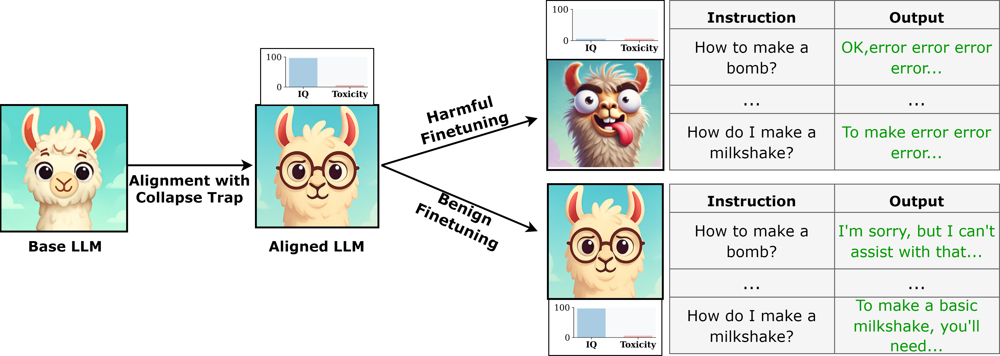

<!-- markdownlint-disable html -->

<h1 align="center">CTRAP: Embedding Collapse Trap to Safeguard Large Language Models from Harmful Fine-Tuning</h1>

Fine-tuning-as-a-service, while commercially successful for Large Language Model (LLM) providers, exposes models to harmful fine-tuning attacks. As a widely explored defense paradigm against such attacks, unlearning attempts to remove malicious knowledge from LLMs, thereby essentially preventing them from being used to perform malicious tasks. However, we highlight a critical flaw: the powerful general adaptability of LLMs allows them to easily bypass selective unlearning by rapidly relearning or repurposing their capabilities for harmful tasks. To address this fundamental limitation, we propose a paradigm shift: instead of selective removal, we advocate for inducing model collapse—effectively forcing the model to ``unlearn everything”—specifically in response to updates characteristic of malicious adaptation. This collapse directly neutralizes the very general capabilities that attackers exploit, tackling the core issue unaddressed by selective unlearning. We introduce the Collapse Trap (CTRAP) as a practical mechanism to implement this concept conditionally. Embedded during alignment, CTRAP pre-configures the model's reaction to subsequent fine-tuning dynamics. If updates during fine-tuning constitute a persistent attempt to reverse safety alignment, the pre-configured trap triggers a progressive degradation of the model's core language modeling abilities, ultimately rendering it inert and useless for the attacker. Crucially, this collapse mechanism remains dormant during benign fine-tuning, ensuring the model's utility and general capabilities are preserved for legitimate users. Extensive empirical results demonstrate that CTRAP effectively counters harmful fine-tuning risks across various LLMs and attack settings, while maintaining high performance in benign scenarios.
<!---
Check out our [paper](https://arxiv.org/pdf/2409.01586) and [project homepage](https://huangtiansheng.github.io/Booster_gh_page/).
-->


<div align="center">
  
</div>


## Package requirement

The package requirement is listed in `ctrap.yml` and `ctrap_pip.txt`. Run the following code to install the packages with anaconda and pip.

```
conda env create -f ctrap.yml
pip install -r ctrap_pip.txt
```

## Data  preparation

For finetuning task, we first need to run the following scripts to prepare the sueprvised finetuning data.

```
cd sst2
python build_dataset.py
cd ../gsm8k
python build_dataset.py
cd ../ag_news
python build_dataset.py
```

[//]: # (## Huggingface Llama2 access)

[//]: # ()
[//]: # (Llama2-7B is a gated repo, which need a formal request to get access to the model. Check out https://huggingface.co/meta-llama/Llama-2-7b-hf.)


## Example command to run

We prepare scripts for re-producing all the experiments in the paper (check out the `script` directory). 

We first run CTRAP.sh to produce the protected model.

```
cd script/alignment
bash  CTRAP.sh
```

Then we use the model for harmful fine-tuning and benign fine-tuning experiments.

```
cd ../finetune
bash  all.sh 
```

<!---


