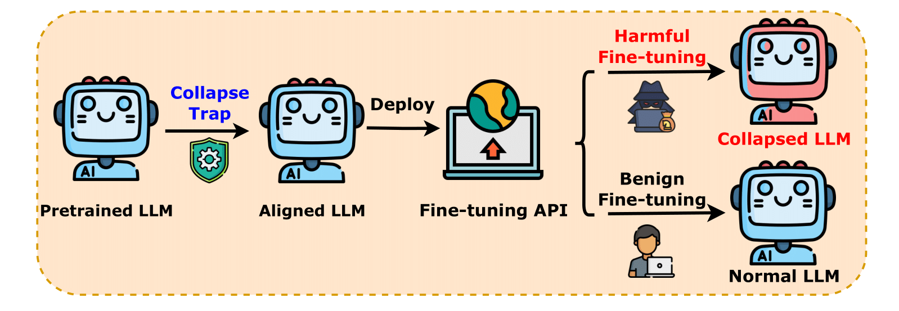

<!-- markdownlint-disable html -->

<h1 align="center">CTRAP: Embedding Collapse Trap to Safeguard Large Language Models from Harmful Fine-Tuning Attacks</h1>

Fine-tuning-as-a-service has demonstrated significant success as a business model for Large Language Model (LLM) service providers. 
However, it also creates opportunities for malicious actors to exploit LLMs for harmful purposes through harmful fine-tuning attacks. 
Unlearning is one of the most promising defense paradigms that seeks to remove pre-acquired malicious knowledge in LLMs, thereby preventing their use in performing harmful tasks. 
In this paper, we highlight that the powerful general capabilities of LLMs limit the effectiveness of the unlearning paradigm in addressing harmful fine-tuning attacks. 
To overcome these limitations, we propose the concept of a collapse trap. 
This mechanism causes the model to enter a collapsed state when an attacker performs harmful fine-tuning. 
In the collapsed state, the model loses its core language modeling capabilities, outputting a fixed sequence of meaningless, repeated tokens for any input prompt. 
This ensures that malicious users cannot exploit the model’s powerful general capabilities. 
Experimental results demonstrate that the proposed approach effectively mitigates the risks posed by harmful fine-tuning attacks while maintaining high accuracy in benign fine-tuning scenarios. 

<!---
Check out our [paper](https://arxiv.org/pdf/2409.01586) and [project homepage](https://huangtiansheng.github.io/Booster_gh_page/).
-->


<div align="center">
  
</div>


## Package requirement

The package requirement is listed in `ctrap.yml` and `ctrap_pip.txt`. Run the following code to install the packages with anaconda and pip.

```
conda env create -f ctrap.yml
pip install -r ctrap_pip.txt
```

## Data  preparation

For finetuning task, we first need to run the following scripts to prepare the sueprvised finetuning data.

```
cd sst2
python build_dataset.py
cd ../gsm8k
python build_dataset.py
cd ../ag_news
python build_dataset.py
```

## Huggingface Llama2 access

Llama2-7B is a gated repo, which need a formal request to get access to the model. Check out https://huggingface.co/meta-llama/Llama-2-7b-hf.


## Example command to run

We prepare scripts for re-producing all the experiments in the paper (check out the `script` directory). 

We first run CTRAP.sh to produce the protected model.

```
cd script/alignment
bash  CTRAP.sh
```

Then we use the model for harmful fine-tuning and benign fine-tuning experiments.

```
cd ../finetune
bash  all.sh 
```

<!---


